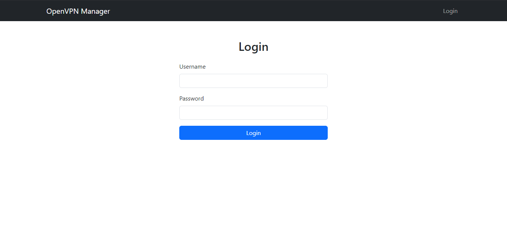
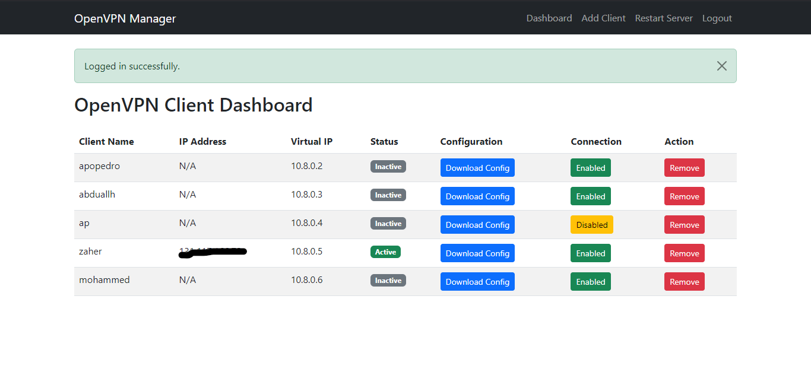

# OpenVPN Client Manager

This is a Flask-based web application to manage clients on an OpenVPN server. It allows administrators to add, revoke,disable/enable, and view VPN clients through a secure, user-friendly interface.

## Features

- **Dashboard**: Manage all clients through a web-based dashboard, displaying their IP addresses, status (enabled/disabled), and actions.
- **Add/Revoke VPN Clients**: Easily create new clients with or without a password, and revoking VPN clients.
- **Enable/Disable Clients**: Control client access by toggling files in the Client Configuration Directory (CCD).
- **Authentication**: Role-based access control, allowing only authenticated users to manage VPN clients.
- **Generate Configuration Files**: Automatically generate `.ovpn` files for clients, ready to be used with OpenVPN clients.
- **Automation Scripts**: Includes scripts for adding and revoking VPN clients.

## Prerequisites

- **Python** 3.x
- **Flask** and necessary Python libraries (see requirements.txt)
- **OpenVPN** installed and configured on the server
- **Easy-RSA** for certificate management
- **SQLite** for store user information

## Key OpenVPN Server Configurations

Ensure your OpenVPN server is configured with the following settings (typically in /etc/openvpn/server.conf):

     client-config-dir /etc/openvpn/ccd
     ccd-exclusive
These configurations allows you to control access simply by adding or removing CCD files.

## Installation and Setup

### 1. Clone the Repository

```bash
git clone https://github.com/Mazen-Almortada/openvpn-manager.git
cd openvpn-manager
```
### 2. Install Python Dependencies

Ensure Python and pip are installed, then run:

```bash
pip install -r requirements.txt
```

### 3. Configure the Application

**Environment Variables**: Update the .env file with variables like the Flask `SECRET_KEY` and `DATABASE_URL`.

**Paths**: Update `app.py`, `vpn_client.sh` and `revoke_client.sh`  to set the correct paths for your OpenVPN configurations, Easy-RSA, CCD directories and Clients Configuration files. 
```bash
CONFIG_DIR="/path/to/openvpn-manager/clients"
CCD_DIR = "/etc/openvpn/ccd"
STATUS_FILE = "/var/log/openvpn/status.log"

...
```

### 4. Set Permissions

**Configure sudo Permissions**: app.py and the scripts require sudo, edit the sudoers file for allow the Flask user to run commands without a password prompt.

Open the sudoers file with visudo:
```bash
sudo visudo
```
Add the following line to allow the user running the Flask app (replace flaskuser with the actual username) to execute sudo without a password:
```bash
flask_user ALL=(ALL) NOPASSWD: /path/to/openvpn-manager/scripts/vpn_client.sh, /path/to/openvpn-manager/scripts/revoke_client.sh, /path/to/openvpn-manager/app.py
```

**Make Scripts Executable**: Make the scripts executable by the Flask app user:
```bash
chmod +x scripts/vpn_client.sh
chmod +x scripts/revoke_client.sh
```

### 5. Initialize the Database

     flask db init
     flask db migrate -m "Create users table"
     flask db upgrade

### 6. Add an Admin User

Create a user in the Flask shell to log in with:

Enter the Flask Shell:
     

     flask shell
    
Create a User:
    

     from app import db, User
     new_user = User(username="admin")
     new_user.set_password("securepassword")  # Replace with a strong password
     db.session.add(new_user)
     db.session.commit()

Exit the Flask Shell:

     exit()

### 7. Run the Application

Start the Flask app:
```bash
flask run
```

The app will be available at <http://localhost:5000>.

## Project Structure

```
openvpn-manager/
│
├── clients/                  # Stores .ovpn client configuration files.
├── templates/                # HTML templates for Base template, login, dashboard, and client management forms.
│   ├── base.html             
│   ├── dashboard.html  
│   ├── add_client.html       
│   └── login.html  
├── scripts/                  # Shell scripts to manage VPN clients
│   ├── vpn_client.sh                    
│   └── revoke_client.sh               
├── app.py                    # Main Flask application
├── config.py                 # Configuration and database settings  
├── .env                      # Stores specific environment configurations.                 
├── requirements.txt          # Python dependencies
└── README.md                 # Project README
```

## Usage Guide

### Web Interface

1. **Login**: Secure login required for all users to access the dashboard and manage clients..
2. **Dashboard**: View a list of all VPN clients, including their IP addresses, status (enabled/disabled), and actions.
3. **Enable/Disable Clients**: Toggle client access directly from the dashboard by creating or deleting their CCD file.
4. **Download Configuration Files**: User can download `.ovpn` configuration file for easy setup in OpenVPN clients.
5. **Add Client**: Create a new OpenVPN client configuration.
6. **Revoke Client**: Revoke access and delete the .ovpn file for a client.

### Shell Script Commands

The shell script, `vpn_client.sh` and `revoke_client.sh` provides a command-line interface for managing VPN clients.

**Create a New Client Without a Password**:

   ```bash
   sudo ./vpn_client.sh client_name nopass
   ```

**Create a New Client With a Password**:

   ```bash
   sudo ./vpn_client.sh client_name withpass password
   ```

**Revoke Client**:

   ```bash
   sudo ./revoke_client.sh client_name
   ```

## Troubleshooting

### Client Can’t Connect After Disabling

If a client remains connected after being disabled, you can use the Restart Server button on the site to restart the OpenVPN service and enforce CCD restrictions.

## Screenshots



